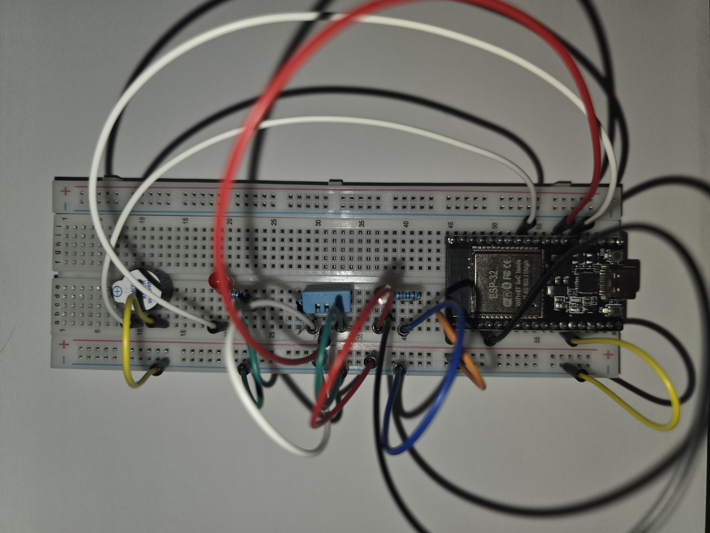
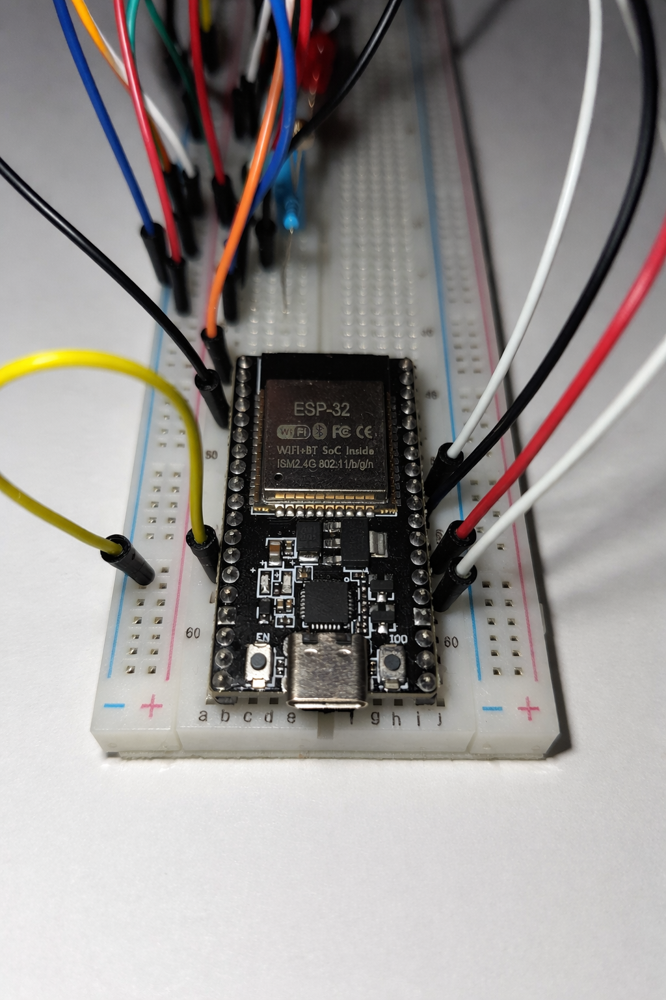
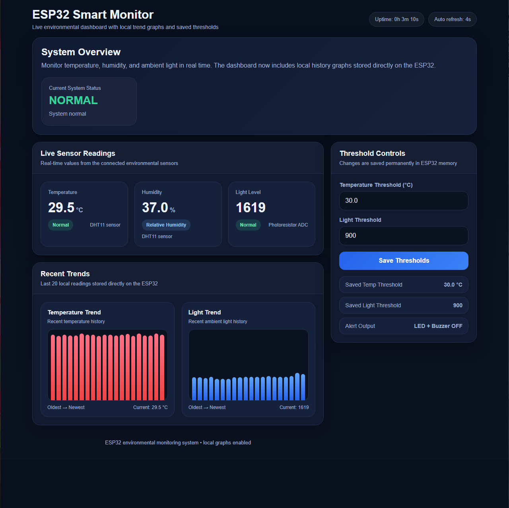
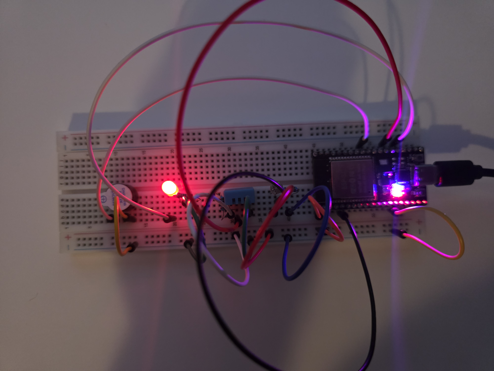

# ESP32 Smart Environment Monitoring System

A real-time IoT monitoring system built with an ESP32 that tracks temperature, humidity, and ambient light, and provides a live web dashboard with alerts, thresholds, and data visualization.

---

## Overview

This project integrates hardware and software to create a complete embedded IoT system. Sensor data is collected, processed on-device, and served through a responsive web interface hosted directly on the ESP32.

---

## Hardware



Components used:
- ESP32 microcontroller (WiFi-enabled)
- DHT11 temperature & humidity sensor
- Photoresistor (light sensor)
- LED (visual alert)
- Active buzzer (audio alert)
- Breadboard and resistors

---

## System Detail



Close-up of the ESP32 and circuit wiring used for sensor interfacing and output control.

---

## Web Dashboard



The ESP32 hosts a real-time dashboard accessible over WiFi, featuring:
- Live sensor readings
- System status (NORMAL / ALERT)
- Adjustable thresholds stored in memory
- Local trend graphs for recent data

---

## Alert System



When thresholds are exceeded:
- LED turns on for visual alerting
- Buzzer activates for audio alerting

---

## Key Features

- Real-time environmental monitoring
- WiFi-based embedded web server with no external backend
- Interactive dashboard with auto-refresh
- Adjustable thresholds stored in non-volatile memory
- Visual and audio alerts
- Local data history with graphical trends

---

## System Architecture

```text
Sensors -> ESP32 -> Data Processing -> Web Server -> Dashboard UI
                       |
                       v
                 Alert Logic -> LED + Buzzer
